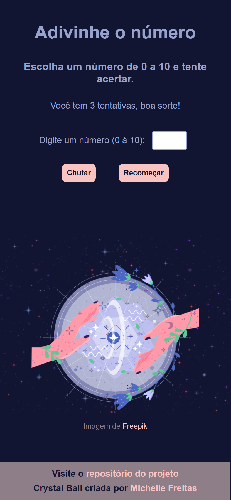
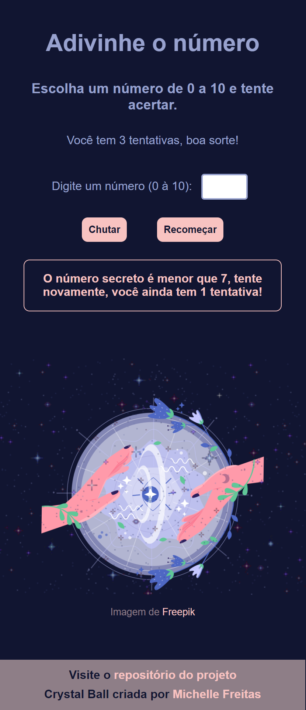

# Adivinhe o número

Jogo de adivinhação, tente adivinhar o número que 'a máquina pensou', você tem 3 tentativas! 

[Visite o jogo](https://github.com/Michelle-Freitas/HMTL5-CSS3-JS/tree/main/meus_projetos/crystal-ball)

### Imagem inicial e imagem de tentativa

<small width="200px">     </small> 

### 🚀 Tecnologias
Esse projeto foi desenvolvido com as seguintes tecnologias:

* HTML e CSS
* JavaScript

