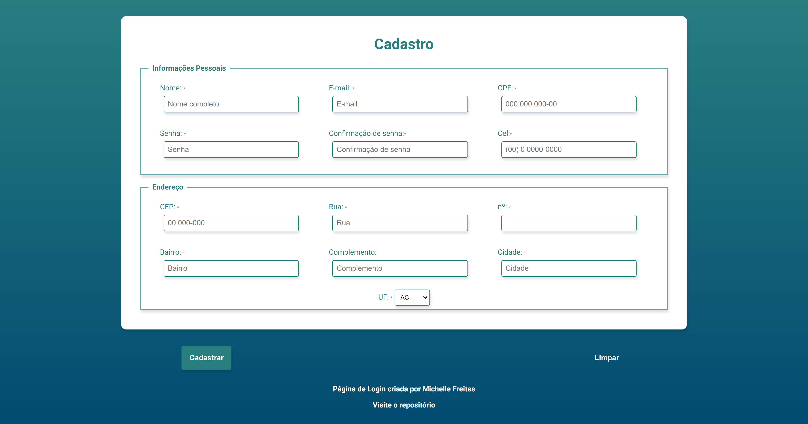

# FORMULÁRIO / FORM

Formulário / Form de cadastro com validação de preenchimento mínimo, caso o input não receba valores mínimos irão aparecer ícones e mensagens de alerta destacados em vermelho, em caso de sucesso serão verdes. Utilizado iMask para máscara de formatação. Digitando um cep, se for válido buscará as informações de rua, bairro, cidade e UF referentes, caso contrário informa que não foi localizado.  

[Visite o Formulário](https://michelle-freitas-form.vercel.app/)

### Imagem de formulário / form
 

### 🚀 Tecnologias
Esse projeto foi desenvolvido com as seguintes tecnologias:

HTML e SASS
JavaScript
Vite
iMask
[cepApi](https://viacep.com.br/)

