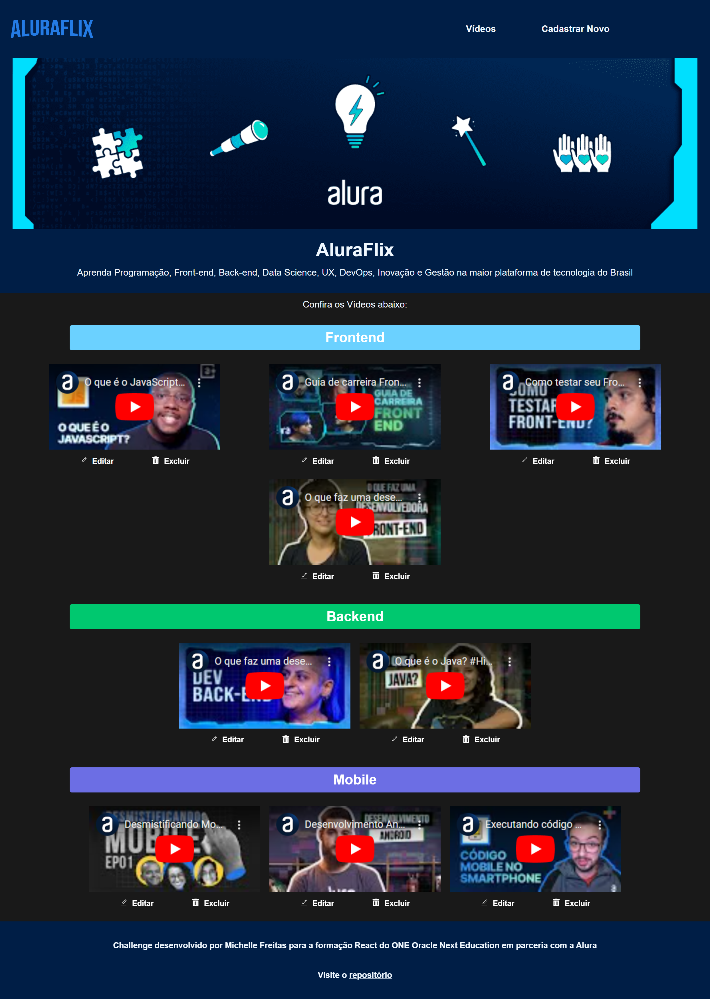
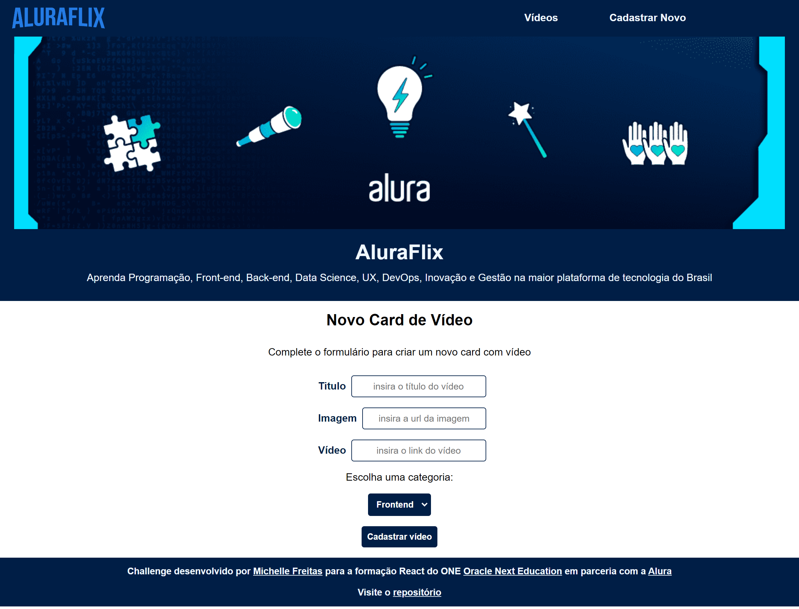

# ALURAFLIX
## Challenge - ONE T6

Página desenvolvida para challenge do programa de formação de Front End T6 - ONE da [Oracle Next Education](https://www.oracle.com/br/education/oracle-next-education/) em parceria com a [Alura](https://www.alura.com.br/)<br/>


## 💻 Projeto
Aplicação desenvolvida com React, CRUD (get, post, put e delete) listando os vídeos pelas categorias de "Frontend", "Backend" e "Mobile", cada card possui um botão para editar em um modal e um botão para excluir. Em outra rota, um formulário para cadastro de novo vídeo.

### Imagem do alurageek




## 🚀 Tecnologias
Esse projeto foi desenvolvido com as seguintes tecnologias:

- JavaScript
- Json-server
- React icons
- React Router Dom
- Context Api

## Executando
Após clonar o repositório, acesse a pasta do projeto e execute os comandos abaixo:

```
    npm run api
    npm run dev
```
