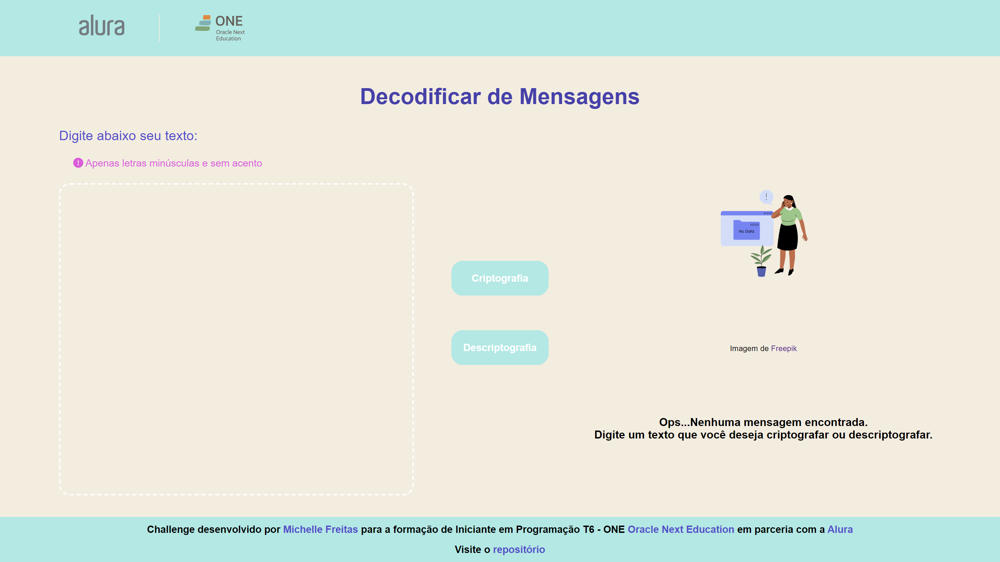
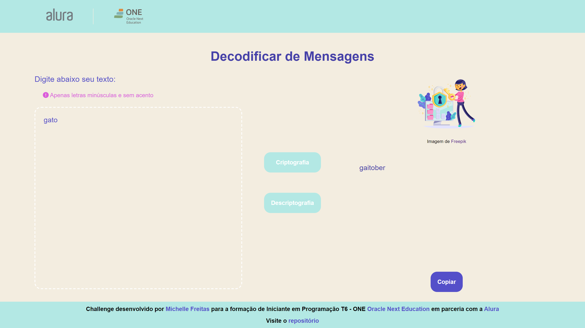
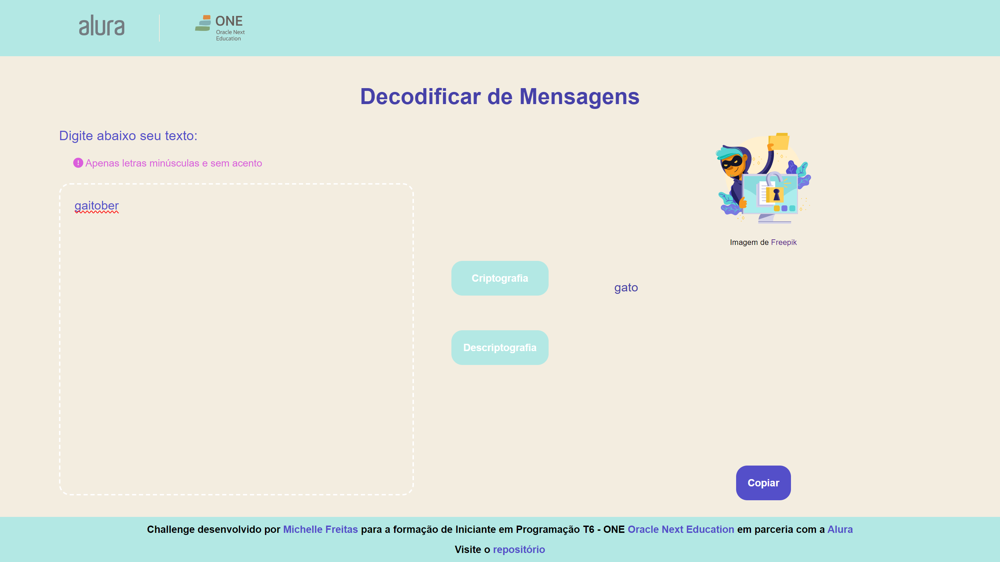

# DECODIFICADOR DE MENSAGENS
## Challenge - ONE T6

Página desenvolvida para challenge do programa de formação de Iniciante em Programação T6 - ONE da [Oracle Next Education](https://www.oracle.com/br/education/oracle-next-education/) em parceria com a [Alura](https://www.alura.com.br/) 

Incluindo uma mensagem (apenas letras minuscúlas e sem acentos) pode escolher se irá criptografar ou descriptografar a mensagem, botões apenas serão habilitados caso área do texto esteja ativa ou não vazia. Implementado também um botão para copiar o resultado obtido. Imagens alteram de acordo com a escolha. 

[Visite o decodificador](https://michelle-freitas.github.io/HMTL5-CSS3-JS/meus_projetos/one_oracle-next-education/challenge_decodificador/index.html)

### Imagem do decodificador sem texto

### Imagem do decodificador com entrada para criptografar

### Imagem do decodificador com entrada para descriptografar

