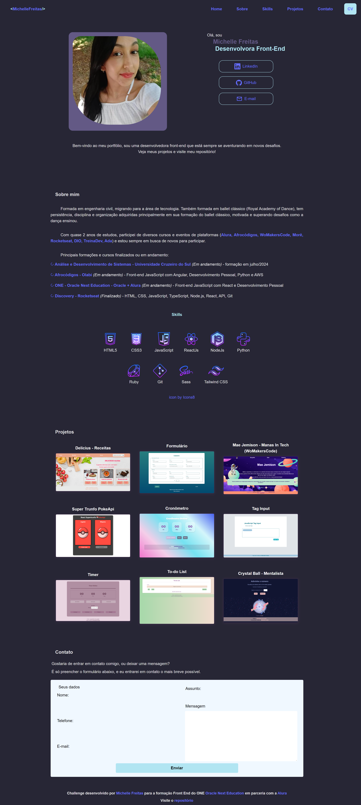

# PORTFÓLIO
## Challenge - ONE T6

Página desenvolvida para challenge do programa de formação de Front End T6 - ONE da [Oracle Next Education](https://www.oracle.com/br/education/oracle-next-education/) em parceria com a [Alura](https://www.alura.com.br/)<br/>

[Visite o portfólio](https://michelle-freitas.github.io/HMTL5-CSS3-JS/meus_projetos/one_oracle-next-education/challenge_portfolio/index.html)


## 💻 Projeto

### Imagem do decodificador sem texto



## 🚀 Tecnologias
Esse projeto foi desenvolvido com as seguintes tecnologias:

- JavaScript
- iMask
- Google icons

## Executando
Após clonar o repositório, acesse a pasta do projeto e execute os comandos abaixo:

```
    npm install
```
